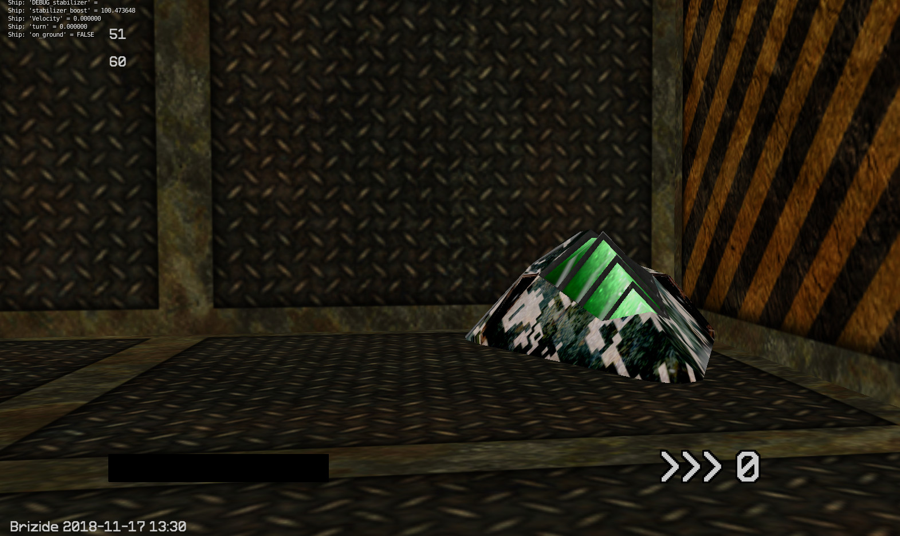
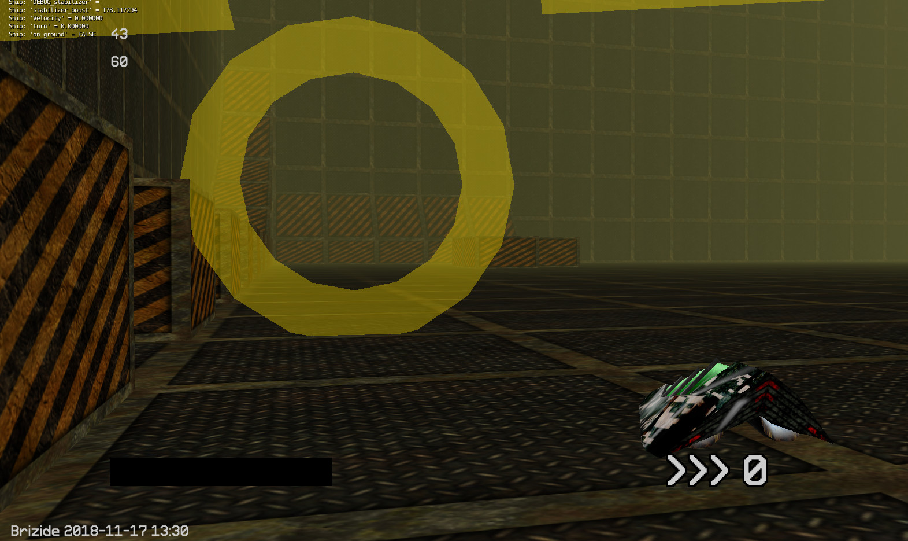

# BriZide

BriZide is a free open-source racing game set in the distant future.
Players race ships on levels in a large cubic space station.

## Story

> Project 'Bright Side' was initiated by the Global Space Program in the year 2353. Its aim was to relocate humanity to colonize planets far from home due to earth's long exhausted resources. A large cubic space ship was built, equipped with everything to keep the population inside occupied and save. For many centuries, the inhabitants were able to maintain a rather regular life until situations in the cube changed. Resources have gone down to a minimum and the government was overthrown. Illegal races are probably the only thing left to maintain some sort of social climate.

## Default Controls

+ **Arrow keys**: Move ship
+ **W**: Boost
+ **S**: Drift
+ **1** - **3**: Change camera

## Documentation and Development
The game is made with the Blender Game Engine.
Check the project wiki or the `docs` folder.

## Download and Install

You need to have Blender installed.

```
git clone https://github.com/Yethiel/BriZide.git
cd BriZide
# optional: git checkout dev
blenderplayer main.blend
```

**The game is not guaranteed to work in the current state.**
Download Blender 2.79 (other versions might work as well) and launch the `main.blend` file.
The source files for the launchers are provided (brizide_bin.blend and brizide_build.blend).
Compiled launchers will be provided at a later point as they are quite large.

## Implemented Features
+ Bare-bones time trial mode
+ Free mode
+ Basic track editor

## Screenshots

