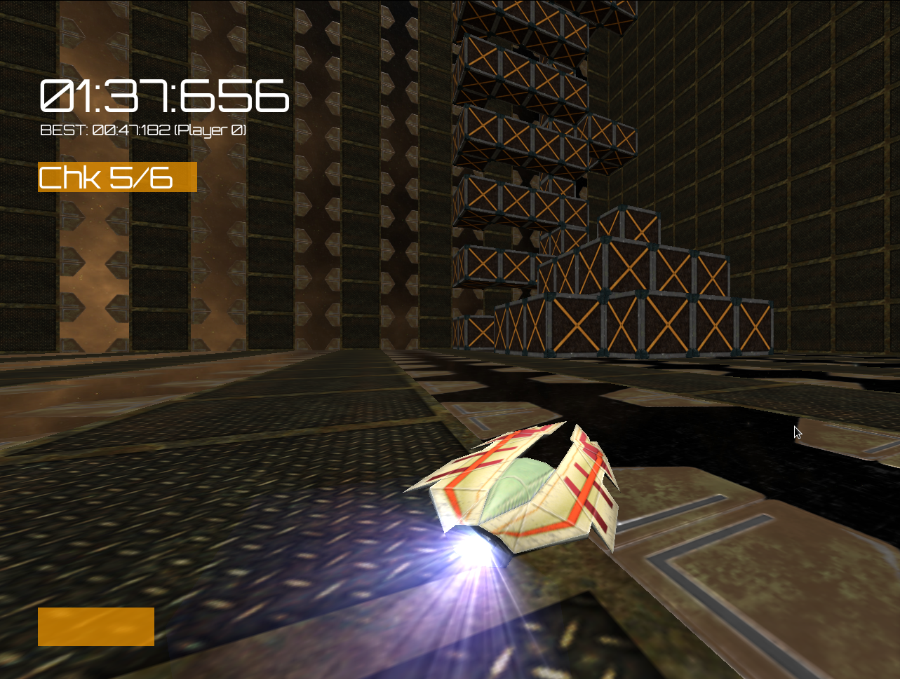

# BriZide

BriZide is a free open-source racing game set in the distant future.
Race anti-gravity ships around levels in a large cubic space station.



## Time Trial
Race around the cube and **collect all checkpoints** in any order. The bar in the top left shows you how many checkpoints are left. The bar in the bottom left shows you how much boost you have. Go sideways to generate boost.
Be quicker than the previous record to set a new highscore.

## Default Controls

Controls can be set in the config.ini file. See the [bge docs](https://docs.blender.org/api/2.79b/bge.events.html#keys-constants) for available keys.

Select options in the main menu with the arrow keys. Press `ENTER` to select a menu entry.

+ `Arrow keys`: Move ship
+ `W`: Boost
+ `S`: Drift
+ `1` - `3`: Change camera
+ `ESC`: Show menu

### Editor

**Note**: The Editor is currently incomplete and might not work correctly. The controls are somewhat similar to Blender's.

+ `W`, `A`, `S`, `D` or `SHIFT` + `MMB`: Drag camera
+ `Q`, `E` or `CTRL` + `MMB`: Zoom out and in
+ `MMB`: Rotate camera
+ `RMB`: Select block
+ `LMB`: Place block
+ `DELETE`: Delete selected block
+ `←`, `→`: Select block to build
+ `CTRL` + `S`: Save level
+ `R`: Enter Rotation Mode
    + `X`, `Y`, `Z`: Select axis
    + `Mouse Movement`: Rotate
+ `G`: Enter Grab Mode
    + `X`, `Y`, `Z`: Select axis
    + `Mouse Movement`: Move selected block

## Download and Install

There's no executable at the moment so you need to have [Blender](https://blender.org) installed.

GNU/Linux:

```
git clone https://github.com/Yethiel/BriZide.git
cd BriZide
# optional: git checkout dev
blenderplayer main.blend
```

Windows:

1. [Download the game](https://github.com/Yethiel/BriZide/archive/master.zip) (optional: [development version](https://github.com/Yethiel/BriZide/archive/dev.zip))
2. Unpack the zip file
3. Open _main.blend_ with Blender and press `P`.

**The game is not guaranteed to work in the current state.**
Download Blender 2.79 (other versions might work as well) and launch the `main.blend` file.
The source files for the launchers are provided (brizide_bin.blend and brizide_build.blend).
Compiled launchers will be provided at a later point as they are quite large.

## Modding
Almost every aspect of this game can be modified.  
Game modes, levels, ships and assets can all be found in the game's folder and easily modified with free software (Blender, Gimp, ...).

A **custom game mode** can be added with just a few lines of code. Copy any game mode folder and start modifying it. You will be able to select it in the _Game Mode_ menu.

**Levels** can be modified and built from scratch with the built-in level editor. You can also make the game load a regular .blend file as a level, too.

**Ships** will be selectable from the main menu soon, as well.

## Implemented Features
+ Bare-bones time trial mode
+ Free mode
+ Basic level editor

## Credits

### Audio
**ZetaSphere**: *Sequence Break* (Time Trial soundtrack)  
**PotatoFace**: Menu theme  
**Pong Pearson**: Announcer voice

## Story

> Project 'Bright Side' was initiated by the Global Space Program in the year 2353. Its aim was to relocate humanity to colonize planets far from home due to earth's long exhausted resources. A large cubic space station was built, equipped with everything to keep the population inside occupied and save. For many centuries, the inhabitants were able to maintain a rather regular life until situations in the cube changed. Resources have gone down to a minimum and the government was overthrown. Illegal races are probably the only thing left to maintain some sort of social climate.
