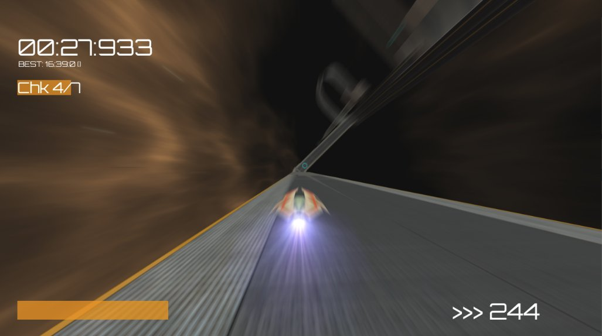

# BriZide

BriZide is a racing game set in the distant future.
Race anti-gravity ships around levels in a large cubic space station.



## Time Trial
Race around the cube and **collect all checkpoints** in any order. The bar in the top left shows you how many checkpoints are left. The bar in the bottom left shows you how much boost you have. Go sideways to generate boost.
Be quicker than the previous record to set a new highscore.

## Default Controls

Controls can be set in the config.ini file. See the [bge docs](https://docs.blender.org/api/2.79b/bge.events.html#keys-constants) for available keys.

Select options in the main menu with the arrow keys. Press `ENTER` to select a menu entry.

+ `Arrow keys`: Move ship
+ `W`: Boost
+ `S`: Drift
+ `1` - `3`: Change camera
+ `ESC`: Show menu
+ Time Trial
    + `BACKSPACE`: Start over

### Editor

**Note**: The Editor is currently incomplete and might not work correctly. The controls are somewhat similar to Blender's.

+ `W`, `A`, `S`, `D` or `SHIFT` + `MMB`: Drag camera
+ `Q`, `E` or `CTRL` + `MMB`: Zoom out and in
+ `MMB`: Rotate camera
+ Select Mode (default):
    + `LMB`: Select block
    + `SHIFT` + `LMB`: Select multiple blocks
    + `CTRL` + `A`: Select or deselect all blocks
    + `DELETE`: Delete selected blocks
    + `CTRL` + `S`: Save level
+ `SHIFT` + `A`: Enter Add Mode
    + `↑`, `↓`: Select block to place
    + `LMB`, `ENTER`: Place block
    + `BACKSPACE`: Leave mode
+ `R`: Enter Rotation Mode
    + `X`, `Y`, `Z`: Select axis
    + `←`, `→`, `↑`, `↓`: Rotate selected blocks
    + `ENTER`, `BACKSPACE`: Leave mode
+ `G`: Enter Grab Mode
    + `X`, `Y`, `Z`: Select axis
    + `←`, `→`, `↑`, `↓`: Move selected blocks
    + `ENTER`, `BACKSPACE`: Leave mode

## Download and Install

Builds for GNU/Linux, macOS and Windows are available [**here**](https://files.re-volt.io/brizide/).

### Development version

Alternatively, you can clone this repo and run the game with Blender:

GNU/Linux:

```
git clone https://github.com/Yethiel/BriZide.git
cd BriZide
blenderplayer brizide.blend
```

Windows:

1. [Download the game](https://github.com/Yethiel/BriZide/archive/master.zip) (optional: [development version](https://github.com/Yethiel/BriZide/archive/dev.zip))
2. Unpack the zip file
3. Open _brizide.blend_ with Blender and press `P`.

## Modding
Almost every aspect of this game can be modified.  
Game modes, levels, ships and assets can all be found in the game's folder and easily modified with free software (Blender, Gimp, text editors, ...).

A **custom game mode** can be added with just a few lines of code. Copy any game mode folder and start modifying it. You will be able to select it in the _Game Mode_ menu.

**Levels** can be modified and built from scratch with the built-in level editor. Copy one of the existing levels and start modifying it with the editor.

**Ships** can be placed in the `ships` folder. They need a .blend file containing a mesh with the same name as the folder name and a .inf file with some information about speed and handling. Copy an existing ship and try modifying it.

## Implemented Features
+ Time trial mode
+ Free mode
+ Basic level editor

## Credits

### Audio
**ZetaSphere**: Time Trial soundtrack  
**Qvarcos**: Editor soundtrack  
**Pong Pearson**: Announcer voice

## Story

> Project 'Bright Side' was initiated by the Global Space Program in the year 2353. Its aim was to relocate humanity to colonize planets far from home due to earth's long exhausted resources. A large cubic space station was built, equipped with everything to keep the population inside occupied and save. For many centuries, the inhabitants were able to maintain a rather regular life until situations in the cube changed. Resources have gone down to a minimum and the government was overthrown. Illegal races are probably the only thing left to maintain some sort of social climate.
